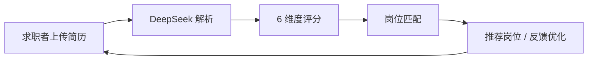

# 智能简历筛选系统

[English Version](./README_EN.md) | [中文说明](./README.md)

<div align="center">

**一个深度适配中文招聘场景的双向智能招聘平台（求职者端 + HR 端）**


[功能展示](#-核心功能) • [快速开始](#-快速开始) • [技术架构](#-技术架构) • [文档](#-文档)

</div>

---

## 📋 项目背景

本项目是一个面向中文招聘场景的**双向平台**：
- 求职者端：支持简历解析评分、优化建议、简历生成与岗位匹配；
- HR 端：支持岗位发布、候选人管理与智能匹配。

针对实际招聘中**中文简历解析精度不足**这一常见痛点，系统通过中文语境优化的解析与评分链路，提升结构化抽取准确率与匹配可信度，建立完整的**简历质量提升闭环**：

```
求职者上传简历 → AI 智能解析与评分 → 个性化优化建议 → 质量提升
                                                      ↓
                                              双向智能匹配 → 精准投递
```

通过 **DeepSeek AI** 的强大语言理解能力，系统能够：
- 🎯 **精准解析** 简历中的隐性信息
- 📊 **多维度评估** 简历质量与岗位匹配度
- 💡 **智能建议** 针对性的简历优化方案
- 🔄 **闭环驱动** 简历质量持续提升

---

### 开发初衷 / 痛点分析

当前开源生态中，绝大多数简历解析方案以英文语料为主，面对中文简历时常出现解析精度下降的问题：

- 中文简历的排版更为多样（表格、两栏、缩进、换行断句不一致），导致基于英文格式假设的解析器难以正确抽取字段；
- 命名实体识别（NER）在中文语境下需要处理姓名、机构、专业等多种歧义与简写，常见开源模型在精确度和召回率上不足；
- 教育背景与学位的描述形式丰富（如“985/211、本科/硕士/研究生在读”等），需要专门的归一化与层级判断；
- 现有工具往往只关注字段抽取，缺乏面向招聘场景的多维度评分与可操作化优化建议。

为了解决这些痛点，本项目采用工程化的解决路线：通过针对中文语境的 Prompt Engineering 优化与领域规则集成，构建“LLM + 规则引擎”的混合解析管道，实现对非结构化简历数据的高精度结构化转换。具体措施包括：

- 针对中文断句与排版特点的预处理（行合并、表格识别、特殊符号规整）；
- 使用定制化 Prompt 模板引导 DeepSeek 返回易于解析的 JSON 结构；
- 模型输出后的后处理（NER 校正、学历归一化、时间区间标准化、单位/薪资格式化）；
- 与规则引擎结合进行置信度评估与回退策略（当模型置信度低时采用启发式正则或人工标注触发重解析）。

因此，本项目不仅是一个"能解析简历"的工具，更是一个面向中文招聘场景的工程化平台，旨在提升解析准确率、评分可信度和最终的面试转化效率。


## ✨ 核心功能

### 1. **AI 智能简历解析**
- 支持 PDF、DOCX 等多格式简历文件
- 深度提取结构化信息：基本信息、教育背景、工作经历、项目经验、技能等
- 自动计算工作年限，识别关键信息

**相关文件：** [apps/resumes/services.py](apps/resumes/services.py#L1) - `ResumeParserService` 类

### 2. **6 维度智能评分体系** ⭐
系统从 **6 个关键维度**对简历进行全面评估，帮助求职者了解简历强弱点：

| 维度 | 评分范围 | 评估标准 |
|------|--------|--------|
| **学历背景** (20%) | 0-100 | 学校档次、专业相关性、教育经历完整性 |
| **工作经验** (25%) | 0-100 | 经验年限、行业相关性、职位匹配度、成就亮点 |
| **项目经验** (20%) | 0-100 | 项目数量、技术含量、参与深度、商业价值 |
| **技能匹配** (15%) | 0-100 | 技能覆盖度、技能深度、前沿技术掌握 |
| **内容质量** (12%) | 0-100 | 表达清晰度、逻辑性、关键词优化、量化数据 |
| **整体竞争力** (8%) | 0-100 | 综合市场竞争力、职业发展轨迹、创新能力 |

> 每个维度的权重可根据不同行业和岗位需求灵活调整

### 3. **个性化简历优化建议**
- 基于 AI 分析的薄弱环节诊断
- 针对性的改进建议和优化方案
- 帮助求职者逐步提升简历竞争力

**相关文件：** [apps/resumes/services.py](apps/resumes/services.py#L150-L200) - 优化建议生成逻辑

### 4. **双向智能匹配系统**
#### 🔵 求职者视角：岗位推荐
- 上传简历后自动匹配合适岗位
- 基于简历内容的个性化推荐
- 一键快速投递

#### 🔴 HR 视角：候选人筛选
- 发布岗位后系统自动匹配候选人
- 支持权重配置（学历、经验、技能权重可调）
- 智能排序展示最匹配的候选人

**相关文件：** [apps/jobs/services.py](apps/jobs/services.py#L1) - `JobMatchService` 类

### 5. **投递与互动管理**
- 完整的投递记录跟踪
- HR 可标记投递状态（待查看 → 已查看 → 感兴趣 → 邀请面试 → 不合适）
- HR 添加候选人备注和评价

**相关文件：** [apps/jobs/models.py](apps/jobs/models.py#L29-L60) - `Application` 模型

### 6. **简历质量提升闭环** 🔁
```
初始简历评分 (60分)
        ↓
    AI 诊断分析
        ↓
优化建议 (新增工作成就、补充项目经验等)
        ↓
求职者根据建议调整简历
        ↓
重新上传 → 重新评分 (82分)
        ↓
匹配度 ↑ → 面试邀请率 ↑
```

---

## 🏗️ 技术架构

### 系统架构图
```
┌─────────────────────────────────────────────────────────────┐
│                     Django Web Application                  │
├─────────────────────────────────────────────────────────────┤
│                                                               │
│  ┌─────────────┐    ┌──────────────┐    ┌───────────────┐  │
│  │   Users     │    │   Resumes    │    │     Jobs      │  │
│  │   App       │    │   App        │    │     App       │  │
│  └─────────────┘    └──────────────┘    └───────────────┘  │
│         ↓                  ↓                     ↓           │
│  [身份认证管理] [简历解析&评分] [岗位&投递管理]             │
│                                                               │
│  ┌────────────────────────────────────────────────────────┐ │
│  │           Core Services (services.py)                 │ │
│  │  ┌──────────────────────────────────────────────────┐ │ │
│  │  │ • ResumeParserService  - 简历解析                │ │ │
│  │  │ • JobMatchService      - 岗位匹配                │ │ │
│  │  │ • DeepSeekClient       - AI 调用                 │ │ │
│  │  └──────────────────────────────────────────────────┘ │ │
│  └────────────────────────────────────────────────────────┘ │
│                                                               │
└─────────────────────────────────────────────────────────────┘
                             ↓
                    ┌────────────────────┐
                    │  DeepSeek API      │
                    │  (AI 核心引擎)     │
                    └────────────────────┘
                             ↓
                    ┌────────────────────┐
                    │  MySQL Database    │
                    │  (数据持久化)      │
                    └────────────────────┘
```

### 技术栈

| 层级 | 技术 | 版本 | 说明 |
|------|------|------|------|
| **后端框架** | Django | 4.2.7 | Web 框架、ORM、Admin |
| **数据库** | MySQL | 8.0+ | 关系数据库 |
| **AI 引擎** | DeepSeek API | Latest | 智能解析与匹配 |
| **文件处理** | PyPDF2 | 3.0+ | PDF 解析 |
| **文件处理** | python-docx | 0.8.11+ | Word 文档解析 |
| **HTTP 请求** | requests | 2.31+ | API 调用 |
| **前端** | Bootstrap | 5.0+ | 响应式 UI |

### 数据库架构
```
users (用户表)
├── id, username, email, password
├── role (hr / jobseeker)
└── created_at

resumes (简历表)
├── id, user_id, file (PDF/DOCX)
├── parsed_data (JSON - 结构化信息)
├── score (AI 评分 0-100)
├── score_details (JSON - 6 维度详细评分)
├── optimization_suggestions (优化建议)
└── status (pending / parsed / failed)

jobs (岗位表)
├── id, hr_user_id, title, company
├── skills_required, job_description
├── salary_min, salary_max
└── is_active

applications (投递记录表)
├── id, job_id, resume_id, jobseeker_id
├── status (pending / viewed / interested / interview / rejected)
├── created_at, viewed_at
└── hr_notes (HR 备注)

match_results (匹配结果表)
├── id, job_id, resume_id
├── match_score (匹配度)
├── match_analysis (匹配分析)
└── created_at
```

### 核心文件索引

| 文件路径 | 功能说明 |
|---------|--------|
| [apps/users/models.py](apps/users/models.py) | 用户认证与身份管理 |
| [apps/users/views.py](apps/users/views.py) | 登录、注册、仪表板视图 |
| [apps/resumes/models.py](apps/resumes/models.py) | 简历数据模型 (AI 评分、优化建议) |
| [apps/resumes/services.py](apps/resumes/services.py) | **简历解析与评分核心逻辑** |
| [apps/resumes/forms.py](apps/resumes/forms.py) | 简历上传表单 |
| [apps/resumes/views.py](apps/resumes/views.py) | 简历管理视图 |
| [apps/jobs/models.py](apps/jobs/models.py) | 岗位、投递、匹配数据模型 |
| [apps/jobs/services.py](apps/jobs/services.py) | **岗位匹配核心算法** |
| [apps/jobs/views.py](apps/jobs/views.py) | 岗位发布、投递管理视图 |
| [system_demo/settings.py](system_demo/settings.py) | Django 配置 & API 密钥管理 |

---

## 🚀 快速开始

### 前置要求
- Python 3.9+
- MySQL 8.0+
- DeepSeek API Key
- pip 或 poetry 包管理工具

### 📥 1. 克隆项目

```bash
git clone https://github.com/yourusername/system_demo.git
cd system_demo
```

### 🔧 2. 创建虚拟环境

```bash
# Windows
python -m venv venv
venv\Scripts\activate

# Linux/Mac
python3 -m venv venv
source venv/bin/activate
```

### 📦 3. 安装依赖

```bash
pip install -r requirements.txt
```

**requirements.txt 包含：**
```
Django==4.2.7
mysqlclient>=2.2
requests>=2.31
PyPDF2>=3.0
python-docx>=0.8.11
```

### 🔐 4. 配置环境变量

> ⚠️ **重要：请使用 `.env.example` 生成 `.env`，并严禁泄露隐私信息（MySQL 密码、DeepSeek API Key、SECRET_KEY）**

使用模板创建 `.env`：

```bash
# Linux / Mac
cp .env.example .env

# Windows PowerShell
Copy-Item .env.example .env
```

然后编辑 `.env`，至少填写以下关键项：

```env
SECRET_KEY=your-secret-key-here
DB_NAME=your_database_name
DB_USER=your_database_user
DB_PASSWORD=your_database_password
DB_HOST=127.0.0.1
DB_PORT=3306
DEEPSEEK_API_KEY=sk-your_deepseek_api_key_here
DEEPSEEK_API_URL=https://api.deepseek.com/v1/chat/completions
```

隐私与安全要求：
- `.env` 仅用于本地/服务器私有配置，**不要提交到 GitHub**；
- 真实密钥与密码只能保存在 `.env`，不要写入代码、截图或公开文档；
- 对外分享项目时，仅提供 `.env.example`。

在 `system_demo/settings.py` 中加载 `.env` 配置：

```python
import os
from pathlib import Path
from dotenv import load_dotenv

# 加载 .env 文件
load_dotenv()

SECRET_KEY = os.getenv('SECRET_KEY', 'django-insecure-default')
DEBUG = os.getenv('DEBUG', 'False') == 'True'
DATABASES = {
    'default': {
        'ENGINE': os.getenv('DB_ENGINE'),
        'NAME': os.getenv('DB_NAME'),
        'USER': os.getenv('DB_USER'),
        'PASSWORD': os.getenv('DB_PASSWORD'),
        'HOST': os.getenv('DB_HOST'),
        'PORT': os.getenv('DB_PORT'),
    }
}

DEEPSEEK_API_KEY = os.getenv('DEEPSEEK_API_KEY')
DEEPSEEK_API_URL = os.getenv('DEEPSEEK_API_URL')
```

### 🗄️ 5. 数据库初始化

```bash
# 创建数据库
mysql -u root -p -e "CREATE DATABASE system_demo_db CHARACTER SET utf8mb4 COLLATE utf8mb4_unicode_ci;"

# 执行迁移
python manage.py makemigrations
python manage.py migrate

# 创建超级用户 (用于管理后台)
python manage.py createsuperuser
```

### 🌐 6. 启动开发服务器

```bash
python manage.py runserver 0.0.0.0:8000
```

访问应用：
- 🏠 **首页:** http://localhost:8000/
- 👤 **用户中心:** http://localhost:8000/users/
- 📄 **简历管理:** http://localhost:8000/resumes/
- 💼 **岗位管理:** http://localhost:8000/jobs/
- 🔧 **Django Admin:** http://localhost:8000/admin/

---

## 📸 项目展示

### 架构设计图


### 功能演示视频

<div align="center">

<video controls width="900" poster="功能演示视频.mp4">
        <source src="功能演示视频.mp4" type="video/mp4" />
        您的浏览器不支持视频播放，请直接打开 [功能演示视频.mp4](功能演示视频.mp4)。
</video>

</div>

---

## 🔄 工作流程

### 求职者流程
```
1. 注册/登录 → 
2. 上传简历 (PDF/DOCX) → 
3. 系统 AI 自动解析与评分 → 
4. 查看 6 维度评分和优化建议 → 
5. 根据建议调整简历 → 
6. 查看推荐岗位 → 
7. 一键投递 → 
8. 跟踪投递状态
```

### HR 流程
```
1. 注册/登录 (选择 HR 身份) → 
2. 发布岗位与要求 → 
3. 系统自动匹配简历 → 
4. 查看匹配候选人列表 (智能排序) → 
5. 查看详细简历和匹配分析 → 
6. 标记投递状态 → 
7. 添加备注反馈
```

---

## 🧠 AI 核心特性

### DeepSeek 集成亮点
- ✅ 支持上下文理解，准确捕捉隐性信息
- ✅ 中文优化，对中文简历理解深入
- ✅ 快速响应（平均 2-5 秒）
- ✅ 成本低，适合高频调用

### 评分算法
```
总分 = 学历背景×20% + 工作经验×25% + 项目经验×20% 
       + 技能匹配×15% + 内容质量×12% + 整体竞争力×8%
```

每个维度独立评分（0-100），然后按权重加权平均，最终得到综合评分。

---

## 📚 API 使用说明

### 简历解析 API

```python
from apps.resumes.services import ResumeParserService

# 1. 提取文本
text = ResumeParserService.extract_text('/path/to/resume.pdf')

# 2. 调用 AI 解析
parsed_data = ResumeParserService.parse_with_ai(text)

# 返回示例：
{
    "name": "张三",
    "email": "zhangsan@example.com",
    "work_years": 5,
    "skills": ["Python", "Django", "MySQL"],
    "work_experience": [...],
    "projects": [...]
}
```

### 岗位匹配 API

```python
from apps.jobs.services import JobMatchService
from apps.resumes.models import Resume
from apps.jobs.models import Job

# 匹配简历到岗位
resume = Resume.objects.get(id=1)
job = Job.objects.get(id=1)

match_result = JobMatchService.match_resume_to_job(resume, job)
# 返回匹配分数和详细分析
```

---

## 🔍 常见问题 (FAQ)

### Q1: 如何修改匹配权重？

在 HR 发布岗位时，可以在表单中设置权重：
- 学历权重：0.20-0.30
- 经验权重：0.30-0.50
- 技能权重：0.20-0.40

### Q2: DeepSeek API 调用失败怎么办？

检查以下几点：
1. **API Key 是否正确？** 查看 `.env` 文件
2. **网络连接是否正常？** 确保能访问 https://api.deepseek.com
3. **配额是否充足？** 登录 DeepSeek 控制面板检查

### Q3: 如何自定义评分维度？

编辑 [apps/resumes/services.py](apps/resumes/services.py) 中的 `score_resume` 方法，修改评分标准和权重。

### Q4: 支持哪些文件格式？

目前支持：
- `.pdf` - PDF 文档
- `.docx` / `.doc` - Word 文档
- 其他格式可在 `ResumeParserService.extract_text()` 中扩展

---

## 📖 相关文档

- [📘 DeepSeek API 文档](https://platform.deepseek.com/api-docs)
- [📗 Django 官方文档](https://docs.djangoproject.com/)
- [📙 MySQL 官方文档](https://dev.mysql.com/doc/)

---

## 🤝 贡献指南

欢迎提交 Issue 和 Pull Request！

1. Fork 本项目
2. 创建特性分支 (`git checkout -b feature/AmazingFeature`)
3. 提交改动 (`git commit -m 'Add some AmazingFeature'`)
4. 推送到分支 (`git push origin feature/AmazingFeature`)
5. 开启 Pull Request

---

## 📄 许可证

本项目采用 MIT 许可证，详见 [LICENSE](LICENSE) 文件。

---

## 📧 联系方式

- 📨 **Email:** yanyingtong@bupt.edu.cn
- 💬 **GitHub Issues:** [提交问题](../../issues)

---

<div align="center">

⭐ 如果这个项目对你有帮助，欢迎 Star！

Made with ❤️ by Yingtong Yan

</div>
