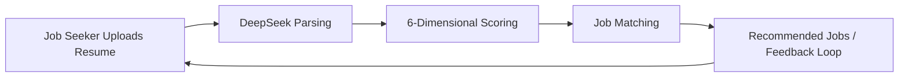

# Intelligent Resume Screening System

<div align="center">

**A bi-directional intelligent recruitment platform deeply adapted to Chinese hiring scenarios (Job Seeker + HR)**


[Features](#-features) • [Quick Start](#-quick-start) • [Architecture](#-architecture) • [Documentation](#-documentation)

</div>

---

## 📋 Project Overview

This project is a **bi-directional platform** for Chinese recruitment scenarios:
- Job Seeker side: resume parsing and scoring, optimization suggestions, resume generation, and job matching.
- HR side: job posting, candidate management, and intelligent matching.

It is also deeply optimized for the **Chinese-language context**, addressing a common market pain point: many existing tools parse Chinese resumes inaccurately. With Chinese-aware parsing and scoring, this system improves extraction accuracy and matching reliability, forming a complete **resume quality improvement loop**:

```
Resume Upload → AI Analysis & Scoring → Optimization Suggestions → Quality Enhancement
                                                                             ↓
                                                          Bi-directional Intelligent Matching → Precise Job Placement
```

Leveraging **DeepSeek AI's** advanced language understanding, the system delivers:
- 🎯 **Precise Parsing** - Extract hidden insights from resumes
- 📊 **Multi-dimensional Assessment** - Evaluate resume quality and job match accuracy
- 💡 **Smart Recommendations** - Personalized optimization strategies
- 🔄 **Continuous Improvement Loop** - Progressive quality enhancement

---

### Motivation & Problem Statement

Most open-source resume parsing solutions today are optimized around English-language assumptions and datasets. This creates a practical gap when handling Chinese resumes: layout styles, entity conventions, and education/degree descriptions are significantly different and often cause extraction failures or misclassifications.

Key challenges addressed by this project:

- Chinese resume layouts are highly variable (tables, multi-column layouts, irregular line breaks), which breaks parsers that assume English-style formatting.
- Named Entity Recognition (NER) for Chinese requires special handling for personal names, organizations, majors and abbreviations; generic models often underperform on precision and recall.
- Education and degree descriptions (e.g. references to "985/211", degrees in non-standard phrasing, ongoing study) need normalization and hierarchical judgment.
- Existing tools typically focus on field extraction only and lack recruitment-oriented scoring dimensions and actionable optimization guidance.

From an engineering perspective, this project closes the gap by combining targeted Prompt Engineering for Chinese with domain-specific rule post-processing: a hybrid "LLM + rules" pipeline that yields high-precision structured conversions from unstructured resume text. Implementation highlights include:

- Preprocessing optimized for Chinese typography (line merging, table detection, special-symbol normalization);
- Domain-tuned prompts that instruct DeepSeek to output parseable JSON schemas;
- Post-processing steps for NER correction, degree normalization, time-span standardization and numeric/unit formatting;
- Confidence scoring and fallback strategies (rule-based extraction when model confidence is low).

As a result, this project is not just a parser — it is an engineering platform tailored for Chinese recruitment scenarios, delivering higher extraction accuracy, more reliable scoring, and better downstream matching and conversion metrics.


## ✨ Core Features

### 1. **AI-Powered Resume Parsing**
- Support for multiple formats: PDF, DOCX
- Deep extraction of structured information: personal info, education, work experience, projects, skills
- Auto-calculation of years of experience
- Intelligent key information recognition

**Related File:** [apps/resumes/services.py](apps/resumes/services.py#L1) - `ResumeParserService` class

### 2. **6-Dimensional Intelligent Scoring System** ⭐
The system comprehensively evaluates resumes across **6 key dimensions**, helping job seekers understand their resume's strengths and weaknesses:

| Dimension | Score Range | Assessment Criteria |
|-----------|-------------|------------------|
| **Education Background** (20%) | 0-100 | School prestige, major relevance, education completeness |
| **Work Experience** (25%) | 0-100 | Years of experience, industry relevance, position matching, achievements |
| **Project Experience** (20%) | 0-100 | Number of projects, technical depth, contribution level, business value |
| **Skill Match** (15%) | 0-100 | Skill coverage, skill depth, cutting-edge technology proficiency |
| **Content Quality** (12%) | 0-100 | Expression clarity, logic flow, keyword optimization, quantified metrics |
| **Overall Competitiveness** (8%) | 0-100 | Market competitiveness, career trajectory, innovation capability |

> Each dimension's weight can be flexibly adjusted based on industry and position requirements

### 3. **Personalized Resume Optimization Suggestions**
- AI-driven weakness identification and diagnosis
- Targeted improvement recommendations
- Progressive resume competitiveness enhancement

**Related File:** [apps/resumes/services.py](apps/resumes/services.py#L150-L200) - Optimization suggestion generation logic

### 4. **Bi-directional Intelligent Matching System**
#### 🔵 Job Seeker Perspective: Job Recommendations
- Automatic job recommendations after resume upload
- Personalization based on resume content
- One-click quick application

#### 🔴 HR Perspective: Candidate Filtering
- Auto candidate matching after job posting
- Configurable weight settings (education, experience, skills weights adjustable)
- Intelligent ranking displaying best-matched candidates

**Related File:** [apps/jobs/services.py](apps/jobs/services.py#L1) - `JobMatchService` class

### 5. **Application & Interaction Management**
- Complete application tracking
- HR status management (pending → viewed → interested → interview invitation → rejected)
- HR notes and candidate feedback system

**Related File:** [apps/jobs/models.py](apps/jobs/models.py#L29-L60) - `Application` model

### 6. **Resume Quality Improvement Loop** 🔁
```
Initial Resume Score (60)
        ↓
    AI Diagnosis Analysis
        ↓
Optimization Suggestions (add achievements, supplement projects)
        ↓
Candidate Updates Resume
        ↓
Reupload → Rescore (82)
        ↓
Match Rate ↑ → Interview Invitations ↑
```

---

## 🏗️ Technical Architecture

### System Architecture Diagram
```
┌─────────────────────────────────────────────────────────────┐
│                     Django Web Application                  │
├─────────────────────────────────────────────────────────────┤
│                                                               │
│  ┌─────────────┐    ┌──────────────┐    ┌───────────────┐  │
│  │   Users     │    │   Resumes    │    │     Jobs      │  │
│  │   App       │    │   App        │    │     App       │  │
│  └─────────────┘    └──────────────┘    └───────────────┘  │
│         ↓                  ↓                     ↓           │
│  [Auth & User Mgmt] [Resume Parse&Score] [Job&Application] │
│                                                               │
│  ┌────────────────────────────────────────────────────────┐ │
│  │           Core Services (services.py)                 │ │
│  │  ┌──────────────────────────────────────────────────┐ │ │
│  │  │ • ResumeParserService  - Resume Parsing        │ │ │
│  │  │ • JobMatchService      - Job Matching          │ │ │
│  │  │ • DeepSeekClient       - AI API Client         │ │ │
│  │  └──────────────────────────────────────────────────┘ │ │
│  └────────────────────────────────────────────────────────┘ │
│                                                               │
└─────────────────────────────────────────────────────────────┘
                             ↓
                    ┌────────────────────┐
                    │  DeepSeek API      │
                    │  (AI Core Engine)  │
                    └────────────────────┘
                             ↓
                    ┌────────────────────┐
                    │  MySQL Database    │
                    │  (Data Persistence)│
                    └────────────────────┘
```

### Technology Stack

| Layer | Technology | Version | Description |
|-------|-----------|---------|------------|
| **Backend Framework** | Django | 4.2.7 | Web framework, ORM, Admin panel |
| **Database** | MySQL | 8.0+ | Relational database |
| **AI Engine** | DeepSeek API | Latest | Intelligent parsing and matching |
| **PDF Processing** | PyPDF2 | 3.0+ | PDF text extraction |
| **Document Processing** | python-docx | 0.8.11+ | Word document parsing |
| **HTTP Client** | requests | 2.31+ | API communication |
| **Frontend** | Bootstrap | 5.0+ | Responsive UI framework |

### Database Schema
```
users (User Table)
├── id, username, email, password
├── role (hr / jobseeker)
└── created_at

resumes (Resume Table)
├── id, user_id, file (PDF/DOCX)
├── parsed_data (JSON - Structured Information)
├── score (AI Score 0-100)
├── score_details (JSON - 6-Dimensional Scores)
├── optimization_suggestions (Optimization Tips)
└── status (pending / parsed / failed)

jobs (Job Posting Table)
├── id, hr_user_id, title, company
├── skills_required, job_description
├── salary_min, salary_max
└── is_active

applications (Application Record Table)
├── id, job_id, resume_id, jobseeker_id
├── status (pending / viewed / interested / interview / rejected)
├── created_at, viewed_at
└── hr_notes (HR Comments)

match_results (Matching Results Table)
├── id, job_id, resume_id
├── match_score (Match Score)
├── match_analysis (Detailed Analysis)
└── created_at
```

### Core File Index

| File Path | Description |
|-----------|------------|
| [apps/users/models.py](apps/users/models.py) | User authentication and identity management |
| [apps/users/views.py](apps/users/views.py) | Login, registration, and dashboard views |
| [apps/resumes/models.py](apps/resumes/models.py) | Resume data model (AI scoring, suggestions) |
| [apps/resumes/services.py](apps/resumes/services.py) | **Resume parsing and scoring core logic** |
| [apps/resumes/forms.py](apps/resumes/forms.py) | Resume upload form |
| [apps/resumes/views.py](apps/resumes/views.py) | Resume management views |
| [apps/jobs/models.py](apps/jobs/models.py) | Job posting, application, matching models |
| [apps/jobs/services.py](apps/jobs/services.py) | **Job matching core algorithm** |
| [apps/jobs/views.py](apps/jobs/views.py) | Job posting and application management views |
| [system_demo/settings.py](system_demo/settings.py) | Django configuration & API key management |

---

## 🚀 Quick Start

### Prerequisites
- Python 3.9+
- MySQL 8.0+
- DeepSeek API Key
- pip or poetry package manager

### 📥 1. Clone Repository

```bash
git clone https://github.com/yourusername/system_demo.git
cd system_demo
```

### 🔧 2. Create Virtual Environment

```bash
# Windows
python -m venv venv
venv\Scripts\activate

# Linux/Mac
python3 -m venv venv
source venv/bin/activate
```

### 📦 3. Install Dependencies

```bash
pip install -r requirements.txt
```

**requirements.txt contains:**
```
Django==4.2.7
mysqlclient>=2.2
requests>=2.31
PyPDF2>=3.0
python-docx>=0.8.11
```

### 🔐 4. Environment Configuration

> ⚠️ **CRITICAL: Generate `.env` from `.env.example` and never expose private data (MySQL password, DeepSeek API key, SECRET_KEY).**

Create `.env` from the template:

```bash
# Linux / Mac
cp .env.example .env

# Windows PowerShell
Copy-Item .env.example .env
```

Then edit `.env` and fill at least these required values:

```env
SECRET_KEY=your-secret-key-here
DB_NAME=your_database_name
DB_USER=your_database_user
DB_PASSWORD=your_database_password
DB_HOST=127.0.0.1
DB_PORT=3306
DEEPSEEK_API_KEY=sk-your_deepseek_api_key_here
DEEPSEEK_API_URL=https://api.deepseek.com/v1/chat/completions
```

Privacy and security rules:
- `.env` is private and must never be committed to GitHub.
- Keep real keys/passwords only in `.env`, never in source code, screenshots, or public docs.
- Share only `.env.example` when publishing the project.

Load `.env` configuration in `system_demo/settings.py`:

```python
import os
from pathlib import Path
from dotenv import load_dotenv

# Load .env file
load_dotenv()

SECRET_KEY = os.getenv('SECRET_KEY', 'django-insecure-default')
DEBUG = os.getenv('DEBUG', 'False') == 'True'
DATABASES = {
    'default': {
        'ENGINE': os.getenv('DB_ENGINE'),
        'NAME': os.getenv('DB_NAME'),
        'USER': os.getenv('DB_USER'),
        'PASSWORD': os.getenv('DB_PASSWORD'),
        'HOST': os.getenv('DB_HOST'),
        'PORT': os.getenv('DB_PORT'),
    }
}

DEEPSEEK_API_KEY = os.getenv('DEEPSEEK_API_KEY')
DEEPSEEK_API_URL = os.getenv('DEEPSEEK_API_URL')
```

### 🗄️ 5. Database Initialization

```bash
# Create database
mysql -u root -p -e "CREATE DATABASE system_demo_db CHARACTER SET utf8mb4 COLLATE utf8mb4_unicode_ci;"

# Run migrations
python manage.py makemigrations
python manage.py migrate

# Create superuser (for admin panel)
python manage.py createsuperuser
```

### 🌐 6. Start Development Server

```bash
python manage.py runserver 0.0.0.0:8000
```

Access the application:
- 🏠 **Home:** http://localhost:8000/
- 👤 **User Center:** http://localhost:8000/users/
- 📄 **Resume Management:** http://localhost:8000/resumes/
- 💼 **Job Management:** http://localhost:8000/jobs/
- 🔧 **Django Admin:** http://localhost:8000/admin/

---

## 📸 Project Showcase

### Architecture Design Diagram


### Demo Video

<div align="center">

<video controls playsinline style="max-width: 100%; height: auto;" poster="https://raw.githubusercontent.com/yanyingtong2025/AI-Chinese-Resume-Hub/main/%E5%8A%9F%E8%83%BD%E6%BC%94%E7%A4%BA%E8%A7%86%E9%A2%91.mp4">
    <source src="https://raw.githubusercontent.com/yanyingtong2025/AI-Chinese-Resume-Hub/main/%E5%8A%9F%E8%83%BD%E6%BC%94%E7%A4%BA%E8%A7%86%E9%A2%91.mp4" type="video/mp4" />
</video>

</div>

---

## 🔄 Workflow

### Job Seeker Workflow
```
1. Register/Login → 
2. Upload Resume (PDF/DOCX) → 
3. System AI auto-parsing and scoring → 
4. View 6-dimensional scores and suggestions → 
5. Update resume based on suggestions → 
6. View recommended jobs → 
7. One-click application → 
8. Track application status
```

### HR Workflow
```
1. Register/Login (select HR role) → 
2. Post job with requirements → 
3. System auto-matches candidates → 
4. View matched candidates list (intelligently ranked) → 
5. Review detailed resumes and matching analysis → 
6. Update application status → 
7. Add notes and feedback
```

---

## 🧠 AI Core Features

### DeepSeek Integration Highlights
- ✅ Context understanding captures hidden insights
- ✅ Optimized for Chinese language processing
- ✅ Fast response time (average 2-5 seconds)
- ✅ Cost-effective for high-frequency calls

### Scoring Algorithm
```
Total Score = Education×20% + Work Experience×25% + Projects×20% 
              + Skills×15% + Content Quality×12% + Competitiveness×8%
```

Each dimension is independently scored (0-100), then weighted and averaged for a comprehensive score.

---

## 📚 API Usage Guide

### Resume Parsing API

```python
from apps.resumes.services import ResumeParserService

# 1. Extract text
text = ResumeParserService.extract_text('/path/to/resume.pdf')

# 2. Call AI parsing
parsed_data = ResumeParserService.parse_with_ai(text)

# Example response:
{
    "name": "Zhang San",
    "email": "zhangsan@example.com",
    "work_years": 5,
    "skills": ["Python", "Django", "MySQL"],
    "work_experience": [...],
    "projects": [...]
}
```

### Job Matching API

```python
from apps.jobs.services import JobMatchService
from apps.resumes.models import Resume
from apps.jobs.models import Job

# Match resume to job
resume = Resume.objects.get(id=1)
job = Job.objects.get(id=1)

match_result = JobMatchService.match_resume_to_job(resume, job)
# Returns match score and detailed analysis
```

---

## 🔍 Frequently Asked Questions (FAQ)

### Q1: How to modify matching weights?

When posting a job, HR can set weights in the form:
- Education weight: 0.20-0.30
- Experience weight: 0.30-0.50
- Skills weight: 0.20-0.40

### Q2: What if DeepSeek API calls fail?

Check the following:
1. **Is API Key correct?** Check your `.env` file
2. **Is network connection working?** Ensure access to https://api.deepseek.com
3. **Do you have sufficient quota?** Check DeepSeek dashboard

### Q3: How to customize scoring dimensions?

Edit the `score_resume` method in [apps/resumes/services.py](apps/resumes/services.py), modifying scoring criteria and weights.

### Q4: What file formats are supported?

Currently supported:
- `.pdf` - PDF documents
- `.docx` / `.doc` - Word documents
- Other formats can be added in `ResumeParserService.extract_text()`

---

## 📖 Related Documentation

- [📘 DeepSeek API Documentation](https://platform.deepseek.com/api-docs)
- [📗 Django Official Documentation](https://docs.djangoproject.com/)
- [📙 MySQL Official Documentation](https://dev.mysql.com/doc/)

---

## 🤝 Contributing

We welcome Issues and Pull Requests!

1. Fork the repository
2. Create a feature branch (`git checkout -b feature/AmazingFeature`)
3. Commit your changes (`git commit -m 'Add some AmazingFeature'`)
4. Push to the branch (`git push origin feature/AmazingFeature`)
5. Open a Pull Request

---

## 📄 License

This project is licensed under the MIT License - see [LICENSE](LICENSE) file for details.

---

## 📧 Contact

- 📨 **Email:** yingtong.yan@se25.qmul.ac.uk
- 💬 **GitHub Issues:** [Submit an Issue](../../issues)

---

<div align="center">

⭐ If this project helps you, please give it a Star!

Made with ❤️ by Yingtong Yan

</div>
